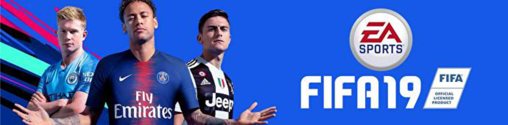

# Soal Ujian Data Science - Machine Learning

## **Soal 1 - Hunting Pemain Bola ⚽**

Anda adalah seorang manager klub sepakbola ternama yang ingin merekrut pemain sepakbola muda berbakat. Pemain yang Anda targetkan untuk direkrut memiliki kriteria sebagai berikut:

- [x] Usia (__Age__) __<= 25__ tahun, 
- [x] Skill umum (__Overall__) __>= 80__ point, dan
- [x] Potensi (__Potential__) __>= 80__ point. 

Tersedia __1 buah dataset (.csv)__ yang memuat data lengkap pemain sepakbola profesional kelas dunia. Unduh dataset via Kaggle: [klik di sini](https://www.kaggle.com/karangadiya/fifa19). __Dilarang keras untuk menyunting/mengubah konten dataset!__ 

Dengan memanfaatkan dataset tersebut, buatlah sebuah file __python (.py)__ atau kernel __Jupyter notebook (.ipynb)__ yang berisi model Machine Learning yang dapat mengklasifikasikan pemain yang Anda targetkan untuk direkrut. Gunakan minimal __3 buah algoritma model machine learning__ _(pilihan model bebas)_, lalu bandingkan & tentukan model mana yang memiliki akurasi terbaik. Kemudian gunakan model tersebut untuk mengklasifikasikan data __pemain di bawah ini__ apakah tergolong pemain yang patut Anda rekrut atau tidak:

Name | Club | Nationality | Age | Overall | Potential
--|--|--|--|--|--
Andik Vermansyah | Madura United FC |  Indonesia | 27 | 87 | 90
Awan Setho Raharjo | Bhayangkara FC |  Indonesia | 22 | 75 | 83
Bambang Pamungkas | Persija Jakarta |  Indonesia | 38 | 85 | 75
Cristian Gonzales | PSS Sleman |  Indonesia | 43 | 90 | 85
Egy Maulana Vikri | Lechia Gdańsk |  Indonesia | 18 | 88 | 90
Evan Dimas | Barito Putera |  Indonesia | 24 | 85 | 87
Febri Hariyadi | Persib Bandung |  Indonesia | 23 | 77 | 80
Hansamu Yama Pranata | Persebaya Surabaya |  Indonesia | 24 | 82 | 85
Septian David Maulana | PSIS Semarang |  Indonesia | 22 | 83 | 80
Stefano Lilipaly | Bali United |  Indonesia | 29 | 88 | 86

✅ _Commit & push source code jawaban soal ini ke __Github__ Anda, buatlah repo dengan nama __Ujian_Pemain_Bola__. Kemudian lampirkan __url link repo Github__ Anda via email ke lintang@purwadhika.com!_

### *__#HappyCoding__* :relaxed:

#### Lintang Wisesa :love_letter: _lintangwisesa@ymail.com_

[Facebook](https://www.facebook.com/lintangbagus) | 
[Twitter](https://twitter.com/Lintang_Wisesa) |
[Google+](https://plus.google.com/u/0/+LintangWisesa1) |
[Youtube](https://www.youtube.com/user/lintangbagus) | 
:octocat: [GitHub](https://github.com/LintangWisesa) |
[Hackster](https://www.hackster.io/lintangwisesa)
